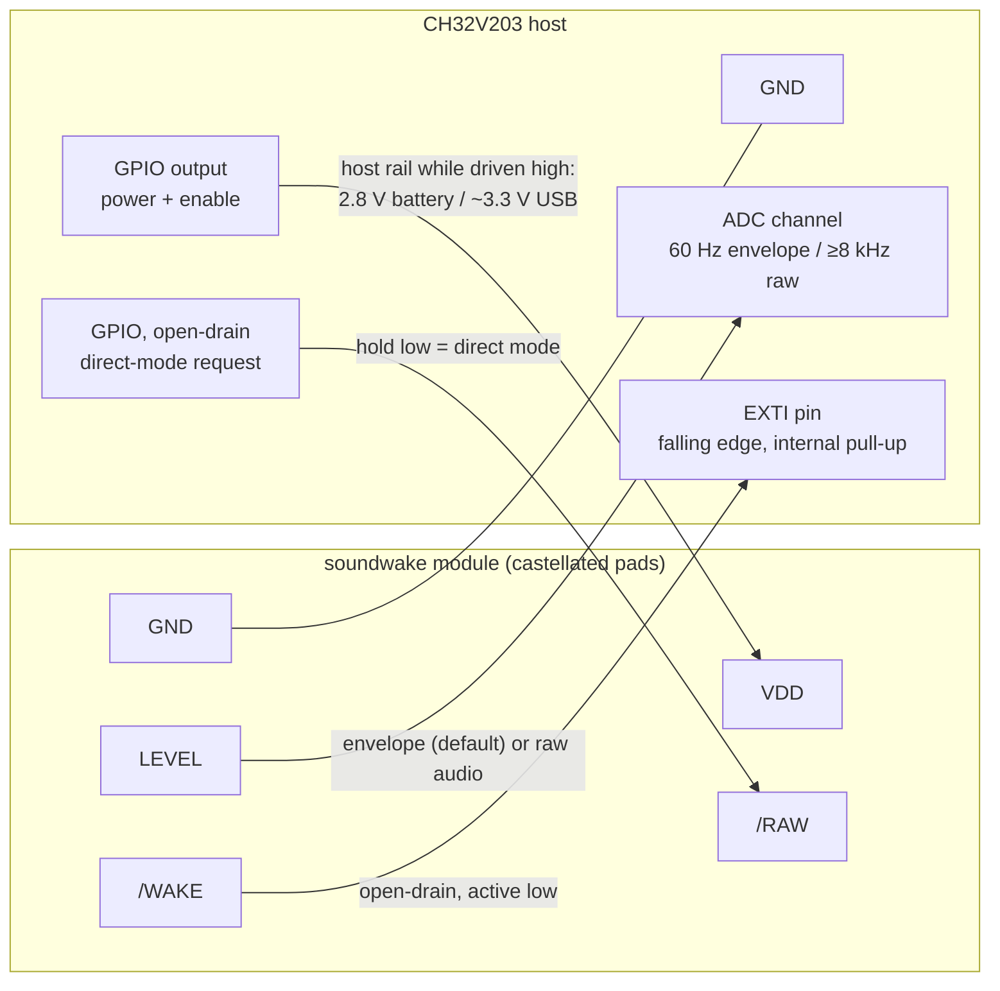
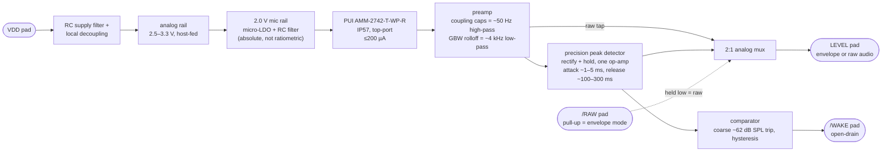
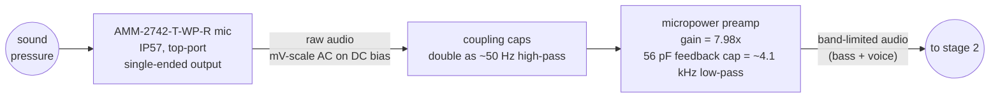
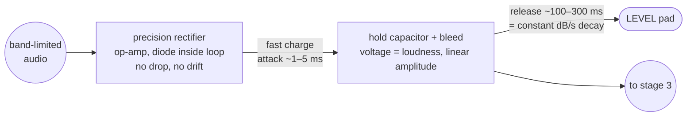
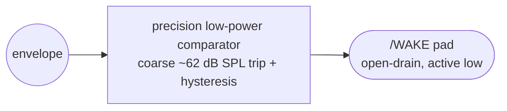

# soundwake

A low-power, always-on sound-level detector breakout board that wakes a sleeping
MCU when the music starts.

`soundwake` is a discrete analog circuit built around a water- and dust-resistant
(IP57-class) analog MEMS microphone. It continuously measures the ambient sound
pressure level (SPL) in the combined **bass + voice** band and exposes the result
on two pins: an analog loudness-envelope output and an active-low wake
interrupt, plus a direct mode that turns the envelope pin into raw
band-limited audio on request. It is designed to be the always-on watchdog subsystem of a
battery-powered, sound-reactive product, drawing well under 350 µA while
everything else sleeps.

## What it does

- **Measures loudness, not audio.** The board outputs a slowly varying envelope
  voltage proportional to sound amplitude — a signal an MCU ADC can poll, not a
  raw microphone waveform. The host converts readings to dB with a `20·log10`
  lookup at 60 fps; keeping the envelope linear keeps the analog chain down to
  textbook blocks and eliminates the log junction's drift and unit spread.
- **Wakes the host on loud sound.** A coarse comparator trip (~62 dB SPL)
  drives `/WAKE` low; the host's EXTI edge-detect latches even the briefest
  pulse, and firmware enforces the true 68 dB SPL threshold plus the
  30–100 ms qualification after waking.
- **Listens to music and people, ignores the wearer.** The detection band covers
  musical bass through the human voice range. Handling noise — the enclosure
  rubbing against clothing — is an explicit rejection target.
- **Direct mode on demand.** Holding the `/RAW` pad low switches `LEVEL` from
  envelope to the raw band-limited audio (50 Hz–4 kHz, mid-rail biased), so the
  host can run FFTs, tune thresholds, or verify the whole chain in production —
  on the single ADC trace it already has.
- **Powers from a host GPIO pin.** The whole detector is powered by one MCU
  GPIO driven high, so the product is default-off and the host can cut the
  detector to zero at any time.

## Interface

Castellated-edge SMT module, five pads. Reflows onto the parent PCB like a
component; solders onto a carrier or headers for bench work.

| Pad     | Direction | Description                                                            |
| ------- | --------- | ---------------------------------------------------------------------- |
| `VDD`   | power     | Supply input, fed directly from a host GPIO pin (see power model below) |
| `GND`   | power     | Ground                                                                  |
| `LEVEL` | out       | Envelope voltage (default) or raw audio in direct mode; full scale ≈ 112 dB SPL |
| `/WAKE` | out       | Active-low comparator, coarse ~62 dB SPL trip; open-drain, host pull-up  |
| `/RAW`  | in        | Hold low for direct mode; module pull-up ⇒ floating = envelope mode      |

### Pinout / host wiring



Physical pad order and module dimensions are still open (see open questions).

### Block diagram — behind the pads



After the cost-down pass and the linear-envelope revision (see below) the
chain is deliberately minimal: five active ICs — one of them the tiny
direct-mode mux, one the mic's 2.0 V micro-LDO — and no math hardware at
all.
Qualification, wake stretching, startup masking, the dB conversion, and the
exact 68 dB threshold all live in host firmware — the EXTI pending flag
latches even a nanosecond comparator blip, so nothing needs to hold `/WAKE`
low in hardware, and the comparator only needs to be coarsely right.

## How the analog sound processor works

The processor is three analog stages plus a firmware tail. Sound becomes a
band-limited signal (stage 1), a single op-amp stage turns it into a loudness
envelope (stage 2), and a comparator provides a coarse wake trip (stage 3).
Everything that used to be timing or math hardware — qualification,
stretching, startup masking, and the dB conversion itself — is firmware.

### Stage 1 — Acoustic front end: sound → band-limited signal

The mic's raw output is millivolt-scale audio riding on a DC bias. The
inter-stage coupling capacitors do double duty as the ~50 Hz high-pass (two
cascaded coupling networks give a second-order corner for free), shedding
rumble and the deepest clothing-rub energy. The micropower preamp is
deliberately limited to **7.98×**. The mic's −42 dBV sensitivity puts 112 dB
SPL at roughly 90 mV peak, so this stage centred at 1.40 V on the 2.8 V
battery rail produces 0.682–2.118 V (with additional headroom at 3.3 V USB).
The remaining gain is in the ground-referenced
precision rectifier, where the signal only has to move from 0 V to the 2.2 V
envelope full scale. This replaces the impossible old “25× around mid-rail”
allocation; see [`simulation/gain-split.md`](simulation/gain-split.md).

The lower preamp gain no longer gets a 4 kHz corner for free from the 100 kHz
GBW. A 56 pF feedback capacitor across the 698 kΩ gain resistor deliberately
sets the approximately 4.1 kHz low-pass corner. No extra active filter stage
is fitted.



The executable pre-schematic contract is in
[`simulation/front-end-contract.json`](simulation/front-end-contract.json).
Run its deterministic rail, passive-corner, gain/headroom, and named-node gate
with:

```powershell
python simulation/check_front_end.py
```

[`simulation/front-end-netlist.md`](simulation/front-end-netlist.md) lists the
named analog nodes and required test points that the KiCad schematic must
preserve. This calculation is not a substitute for the selected op-amp
macro-model, SPL calibration, or prototype measurements.

### Stage 2 — Precision peak detector: audio → loudness envelope

A gain-configured micropower precision rectifier (gain = **3.05×**; the diode sits
inside the feedback loop, so its drop and drift cancel) charges a hold
capacitor through a fast path (attack ~1–5 ms, one kick registers at full
height) while a bleed discharges it (release ~100–300 ms). Exponential decay
in the linear domain *is* constant dB-per-second decay, so the release still
falls musically between beats. The op-amp output is low-impedance and drives
the `LEVEL` pad directly. No junction log element exists anywhere — the host
computes `dB = 20·log10(reading)` from a lookup table at 60 fps, oversampling
~16× per frame to recover quiet-end resolution.



### Stage 3 — Wake comparator: coarse trip → `/WAKE`

A precision low-power comparator with hysteresis drives the open-drain
`/WAKE` pad directly. Its trip is deliberately set **coarse and low (~62 dB
SPL)**: at linear-envelope levels, 68 dB SPL is only ~14 mV, so the selected
TLV9021's +/-2 mV maximum offset is a material safety bound. Set ~6 dB low,
and worst-case positive offset still cannot push the trip above 68 dB (a unit
that can't wake would be a field failure), and negative offset merely causes
early wakes that firmware filters. The threshold divider references the
**absolute 2.0 V mic rail, not VDD** — so the trip point does not move when
the host rail steps between 2.8 V and 3.3 V (see decision 10). The exact
68 dB threshold is enforced in firmware from `LEVEL`, in dB domain, to
~±0.5 dB.



### Direct mode — raw audio on the `LEVEL` pad

Holding `/RAW` low flips a 2:1 analog mux so `LEVEL` carries the preamp's
band-limited audio (50 Hz–4 kHz, riding the mid-rail bias) instead of the
envelope. The peak detector and wake comparator keep running — the module
still wakes the host while in direct mode. The host samples at ≥8–10 kHz and
subtracts the bias in software. Quality is voice-band monitor grade
(micropower-preamp noise floor): right for FFT/beat analysis, threshold
tuning, bring-up, and production test; wrong for recording music. Hardware
cost: one SC70 mux (<1 µA, ~$0.05–0.15) and the fifth pad.

### Firmware tail — the wake decision

The timing behavior removed from hardware, as the host now implements it:


## Target specifications

| Parameter              | Target                                | Notes                                                    |
| ---------------------- | ------------------------------------- | -------------------------------------------------------- |
| Total supply current   | **< 350 µA** budget; ~226–266 µA projected | Mic's 200 µA max dominates (no typical published); see current budget |
| Power source           | Host GPIO pin, **2.8–3.3 V** dual-level | 2.8 V on battery, ~3.3 V on USB; envelope + trip are absolute, not ratiometric |
| Detection band         | ~50 Hz – 4 kHz (bass + voice)         | Exact corners TBD                                        |
| Wake threshold (effective) | 68 dB SPL, enforced in firmware   | ~±0.5 dB electrical + the mic's ±1–3 dB sensitivity spread |
| Hardware wake trip     | ~62 dB SPL, coarse, fixed             | Set low so comparator offset can never push it above 68 dB |
| Wake qualification     | ~30–100 ms sustained, in firmware     | Host wakes on comparator edge, samples `LEVEL`, decides  |
| Wake output            | Raw comparator with hysteresis        | No stretch needed — host EXTI latches any pulse width    |
| `LEVEL` transfer       | Linear-in-amplitude envelope          | Full scale ≈ 112 dB SPL; host does `20·log10` lookup     |
| `LEVEL` accuracy       | ~±0.5 dB above 75 dB SPL              | Quantization-limited below; 16× oversampling ⇒ ~±0.3 dB at 60 dB |
| Envelope dynamics      | Beat-tracking: ~1–5 ms attack, ~100–300 ms release | LEDs can ride individual kicks at 60 fps    |
| Envelope readout rate  | Valid at 60 Hz polling                | Fresh, settled values every ~16 ms                       |
| Direct mode            | `/RAW` low ⇒ `LEVEL` = raw audio      | 50 Hz–4 kHz, mid-rail bias; envelope + wake stay active  |
| Microphone             | PUI AMM-2742-T-WP-R (selected)        | IP57, analog, **top-port**, 200 µA max, 2.0 V rated      |
| Operating environment  | 0–45 °C, mild outdoor                 | Rain resistance via mic IP rating + conformal coat       |
| Board protection       | Conformal coating                     | Coating must mask the mic port (assembly requirement)    |
| BOM cost               | < ~$4; ~$2–3 projected after cost-down | 4 active ICs + roughly a dozen passives                  |
| Assembly               | JLCPCB SMT (design to their catalog)  | *Assumed default — not yet confirmed*                    |

## Architecture decisions

Decisions from the 2026-07-21 design interview, with rationale.

### 1. Power via host GPIO, default-off

The detector's `VDD` is a CH32V203 GPIO driven high. This makes the product
default-off with zero leakage, and gives the host a free kill switch.

The trap this creates: in the CH32V203's deepest **Standby** mode, GPIOs go
high-impedance — the detector would lose power exactly when it should be
listening, and nothing could ever wake the MCU. Therefore the host **must sleep
in Stop mode**, where GPIO output states are retained.

Verified against the CH32V203 datasheet (V2.7, tables 4-8-1/4-8-2, 4-16): Stop
mode with the regulator in low-power mode draws **10.5 µA typ** vs. ~0.5–1.1 µA
in Standby — a ~10 µA penalty, about 3 % of the detector's own budget, so the
GPIO-power scheme stands and no latching load switch is needed. Stop also wakes
in ~76 µs vs. Standby's ~4.8 ms — and since the EXTI pending flag latches the
comparator edge, no wake-pulse stretching is needed anywhere. Two
firmware/part traps:

- Stop entry must select the regulator's low-power mode (`LPDS=1, PDDS=0` in
  PWR_CTLR). With the regulator left in Run mode, Stop draws 70.5 µA.
- The 128K **CH32V203RBT6 is a different die and much worse** (245.7 µA
  regulator-run Stop, 22.9 µA regulator-low-power Stop) — prefer a non-RBT6
  variant.

A side benefit: the GPIO's ~50–100 Ω source impedance plus the module's local
bulk capacitance forms a free low-pass filter against rail noise.

### 2. Linear envelope, dB in firmware (revised 2026-07-21)

`LEVEL` is a linear-amplitude envelope; the host computes
`dB = 20·log10(reading)` via lookup table at 60 fps. This **reverses** the
interview's hardware-dB choice, which was made when the log stage looked
free: in the discrete implementation it costs an op-amp *plus a junction
element*, and that junction is the riskiest, least-cookbook block in the
whole design — while removing it saves only itself, since the op-amp is
needed for precision rectification either way.

What the reversal buys and costs:

- **Error classes eliminated**: junction temperature drift (was ~±1.5–2 dB
  uncompensated) and junction unit-to-unit spread (±1–2 dB). The rectifier
  diode sits inside the op-amp loop and cancels; gain is set by 1 % resistors
  (±0.1 dB).
- **Error class added**: ADC quantization at the quiet end. With full scale at
  112 dB SPL, one 12-bit count is 0.02 dB at 92 dB, 0.2 dB at 72 dB, 1.2 dB at
  57 dB. The LED show's working range (85–112 dB) resolves *better* than the
  log stage delivered; firmware oversampling (~16 reads per frame) recovers
  ~2 effective bits at the quiet end.
- **Companion change (non-negotiable)**: the wake comparator cannot sit at
  68 dB in the linear domain — see decision 4.

### 3. Beat-tracking envelope everywhere

One fast envelope (~1–5 ms attack, ~100–300 ms release) feeds both `LEVEL` and
the wake path. LEDs can pulse with individual kick drums at 60 fps. The cost —
scratches look like kicks — is paid back by firmware time-qualification after
wake, not by slowing the envelope.

### 4. Wake path: coarse comparator, threshold and qualification in firmware

A precision low-power comparator with hysteresis drives `/WAKE` directly,
tripping at a deliberately low ~62 dB SPL. At linear-envelope levels 68 dB is
only ~14 mV, so the selected TLV9021's guaranteed +/-2 mV input offset gives
a worst-case high trip of about 64.2 dB. Sitting ~6 dB low therefore keeps the
hardware trip safely below 68 dB, and early trips just become cheap
firmware-filtered wakes. The
CH32V203's EXTI pending flag latches a comparator pulse of any width, so
nothing needs to hold the line low, and firmware — which had to double-check
anyway — enforces the true 68 dB threshold and the 30–100 ms sustained-energy
qualification by sampling `LEVEL` after waking. A false wake costs on the
order of 0.02 µAh; even hundreds of scratches a day are noise next to the
detector's own always-on budget. This supersedes the interview's "moderate
hardware strictness" choice — same behavior, relocated to firmware for zero
parts.

### 5. Fixed threshold

No trim. One resistor divider sets the coarse hardware trip; the exact 68 dB
is a firmware constant applied to `LEVEL` in dB domain, so unit-to-unit spread
collapses to the mic's own ±1–3 dB sensitivity tolerance — tighter than the
±3–4 dB originally accepted.

### 6. Top-port IP57 mic on a conformal-coated board (re-revised 2026-07-22)

The interview chose a top-port mic; an earlier revision yielded to the
bottom-ported IM73A135V01 believing it was the only component-level IP57
analog MEMS part. The host product's leather-wrapped construction settled
the question the other way: its environmental requirements (host
`docs/environmental-protection.md`) demand a top port with a positively
maintained, drainable clearance in the leather — a bottom port's acoustic
pass-through hole through two PCBs cannot be sealed and drained in that
stack. The selected **PUI AMM-2742-T-WP-R** is top-port, analog, and IP57,
restoring the interview's original orientation. The module PCB no longer
needs a port hole, and the parent's only acoustic requirement is exposed
clearance above the mic. Conformal coating protects the electronics.
**Assembly requirements: the coat must positively mask the exposed top
port (wicked coating is a destructive defect) and terminate at a
repeatable keep-out around it; coating covers the mic sides and pads.**

### 7. Tolerate a noisy shared rail

The parent product PWMs LEDs hard on the same battery. The detector is designed
to meet spec fed from that environment: RC filtering and heavy local
decoupling, with the GPIO feed's ~50–100 Ω source impedance as the series
element — no ferrite is fitted (cost-down). The mic's own 2.0 V rail adds a
post-LDO RC (~60 dB extra attenuation at the host's 24 kHz PWM), and the
mic's datasheet PSR is −100 dB (217 Hz square wave, A-weighted). The host
side carries its own mitigation stack — dual-level rail with peak-hold
reservoir, LED-board bulk capacitance, separate LED PCB, synchronized ADC
sampling — specified in
[soundwave#50](https://github.com/FastLED/soundwave/issues/50). The first
prototype carries test points to characterize how much LED noise actually
reaches the mic path; pass criteria (≤50 µVrms in-band referred to the mic
output) live in that issue.

### 8. Direct mode shares the `LEVEL` pad

The host budget allows a single ADC trace, so raw audio cannot get its own
signal pad. A 2:1 analog mux (SC70, <1 µA, ~$0.05–0.15) selects what `LEVEL`
carries: the envelope by default (module pull-up on `/RAW`), or the preamp's
raw band-limited audio while the host holds `/RAW` low. The host drives
`/RAW` open-drain — pull low to request direct mode, release to return —
which also eliminates any back-feed path into an unpowered module. The
envelope detector and wake comparator keep running in direct mode, and the
raw tap gives the bench test plan a probe point into the front end that a
conformal-coated board otherwise hides.

### 9. CH32V203 internal op-amp: evaluated and rejected

The host MCU has two on-chip op-amp/comparator blocks, which raised the
question of removing an external amp by designing holistically. Datasheet
Table 4-31 settles it: **195 µA static per amp** (no load), Vos 1.5/6 mV —
one internal amp costs 2.5× the entire microphone budget, so it is
disqualified from the always-on listening path regardless of whether it runs
in Stop mode. It remains available to the host for awake-mode uses.

The same evaluation surfaced a firmware-envelope alternative (comparator
watching raw audio peaks, envelope computed digitally while awake, quad→dual
op-amp, mux and `LEVEL` eliminated). **Considered and declined 2026-07-21**:
the analog peak detector stays, keeping the calm hardware wake behavior and
the 60 Hz `LEVEL` interface that works with any host.

### 10. Dual-level host rail: absolute mic rail and trip reference (2026-07-22)

The host's issue-#50 interference analysis restructured its power tree
([soundwave#51](https://github.com/FastLED/soundwave/pull/51)): the rail
feeding this module is now **2.8 V on battery and ~3.3 V while USB is
present**, instead of a fixed 3.0 V. Three module-side consequences
(tracked as [#15](https://github.com/zackees/soundwake/issues/15)):

- **The mic rail becomes absolute.** A ratiometric divider would drag the
  mic supply 2.0→2.6 V with the rail. A fixed **2.0 V micro-LDO**
  (XC6206P202-class, ~1 µA IQ — the fallback already named in the rail
  plan, promoted to primary) pins the mic at its rated 2.0 V in every
  state, followed by an RC (a few hundred Ω into 10–22 µF) that adds
  ~60 dB of rejection at the host's 24 kHz LED PWM on top of the mic's
  own PSR. Datasheet de-risk: the PUI part's sensitivity shifts only
  0.5 dB from 3.6 V down to 1.5 V, so rail-level changes barely touch
  calibration even before the LDO.
- **The trip reference becomes absolute too.** The threshold divider hangs
  off the 2.0 V rail instead of VDD, so the coarse ~62 dB trip is
  rail-independent — a VDD-referenced divider would ride the rail up
  +2.4 dB at 3.3 V, and stacked with worst-case comparator offset the
  effective trip would graze 68 dB, violating decision 4's bound. With
  the absolute reference and TLV9021's +/-2 mV maximum offset, the worst
  case is ≈64.2 dB at both rail
  levels.
- **Envelope full scale is ~112 dB SPL.** A single 25× mid-rail preamp would
  require a ±2.2 V swing and cannot work on either host rail. The realised
  design is a 7.98× mid-rail preamp followed by a 3.05× ground-referenced
  precision rectifier: at 112 dB it produces a 2.19 V envelope while the
  preamp remains at 0.682–2.118 V on the 2.8 V corner. A 56 pF feedback
  capacitor restores the 4.1 kHz low-pass corner that the original gain-25
  GBW rolloff had supplied. The ~62 dB coarse trip remains ~6.9 mV; sounds
  above 112 dB saturate gracefully at the envelope output.

One residual ratiometric surface remains, owned by host firmware: the
host's ADC reference is its own rail, so the absolute envelope reads in
different counts at 2.8 V vs 3.3 V — the host swaps VDDA scale constants
on VBUS transitions (soundwave#52).

## Cost-down pass (2026-07-21)

This is a wearable: worn on the body, its realistic temperature swing is far
narrower than the 0–45 °C ambient spec, and the LED show consuming the dB
value is an aesthetic display, not an instrument. Accuracy in the
little-to-moderate band (roughly 1–10 %) is therefore tradable for parts cost,
board area, and assembly simplicity. Eliminated:

| Eliminated                                    | Function now provided by                                   | Accuracy price                                        |
| --------------------------------------------- | ---------------------------------------------------------- | ----------------------------------------------------- |
| Temperature-compensation network              | Moot — the linear-envelope revision removed the drifting junction entirely | None remaining                          |
| Hardware qualification window + one-shot stretch | EXTI pending-flag latch + firmware qualification         | None — behavior relocated, not removed                 |
| Hardware startup mask                         | Firmware delay before arming EXTI                           | None                                                   |
| Separate rectifier and envelope stages        | Single precision peak-detector op-amp                       | ~1–2 dB program-dependent (half-wave, crest factor)    |
| Log-conversion junction (analog dB output)    | Firmware `20·log10` lookup on 60 fps ADC samples            | Quantization below ~75 dB SPL; oversampling recovers most |
| Dedicated `LEVEL` output buffer               | Log op-amp output is already low-impedance                  | Negligible at 60 Hz ADC sampling                       |
| Active bandpass filter stages                 | Coupling caps (high-pass) + preamp GBW rolloff (low-pass)   | Soft band edges; a few % level error at band extremes  |
| Ferrite bead in supply filter                 | GPIO source impedance + RC + local decoupling               | None expected; verify on first prototype               |

Resulting active BOM: the mic, one dual-or-quad micropower op-amp package
(preamp channels + peak detector), one precision low-power comparator, and the
direct-mode 2:1 mux — **four ICs plus roughly a dozen passives**, projected
parts cost ~$2–3 against the $4 target. After the linear-envelope revision, electrical accuracy is ~±0.5 dB
across the loud range that matters; absolute accuracy is dominated by the
mic's ±1–3 dB sensitivity spread.

## Part candidates and current budget (2026-07-21)

### Microphone: PUI Audio AMM-2742-T-WP-R (selected 2026-07-22)

Top-port analog IP57 MEMS, selected by the host's leather-construction
environmental requirements (which reject the previously chosen bottom-port
IM73A135V01). Datasheet figures:

| Parameter | Value | Note |
| --- | --- | --- |
| Supply current | **200 µA max — no typical published** | Budget at max; measured draw may be lower, not creditable until prototype data |
| Rated voltage | 2.0 V; operating 1.6–3.6 V | The 2.0 V mic rail sits at the characterization point |
| Supply-dependent sensitivity | **0.5 dB shift, 3.6 → 1.5 V** | De-risks the dual-level host rail almost entirely |
| PSR | −100 dB (100 mVpp square, 217 Hz, A-wt) | Multiplies with the mic-rail LDO + RC |
| SNR | 59 dB(A) (94 dB @ 1 kHz) | Noise floor ≈ 35 dB SPL(A) — 33 dB below the 68 dB decision threshold |
| Sensitivity | **−42 dBV ±1 dB** @ 94 dB SPL, 1 kHz | Single-ended; ±1 dB is tighter than the ±1–3 dB previously budgeted |
| Output impedance | 300 Ω @ 1 kHz | AC-coupled into the preamp |
| Acoustic overload | 130 dB SPL (10 % THD) | Above the 112 dB design ceiling |
| Frequency range | 20 Hz – 20 kHz | Coupling caps still set our ~50 Hz corner |
| Absolute max | 4 V any pin; 160 dB SPL | No mode windows, no 3.0 V trap |
| Operating temp | −40…+100 °C at VDD < 3 V | Mic rail is 2.0 V, so the wider window applies |
| Package | top-port, IP57, MSL1 | No port hole through the module PCB; positive port mask during coating |
| Start-up / output DC bias | not published | Assume MEMS-typical 10–30 ms inside the 100 ms mask; measure both at bring-up |
| Price / sourcing | authorized distribution / RFQ | No LCSC listing — hand-place or global sourcing; do not substitute |

### Rail plan

Everything runs on the 2.8–3.3 V GPIO-fed rail **except the mic and the
trip reference**, which get an absolute **2.0 V rail from a micro-LDO**
(XC6206P202-class, ~1 µA IQ) followed by an RC filter at the mic pin — see
decision 10. The LDO input is the module's filtered rail; the 2.8 V
battery-side corner leaves 0.8 V of LDO input headroom at the 200 µA maximum
microphone load. The old buffered-divider implementation is retired (it was
ratiometric); its op-amp channel is freed.

### Current budget

Quad op-amp channel allocation: preamp, peak detector, mid-rail bias
buffer, one spare (freed by the mic-rail LDO — a dual + passive bias
string is the schematic-time cost-down alternative).

| Block | Typ (µA) | Notes |
| --- | --- | --- |
| Mic (budgeted at max) | 200 | No typical published; PUI's max is the planning number |
| Mic-rail micro-LDO | ~1–3 | XC6206P202-class IQ |
| Quad op-amp (4 ch) | 2.4 – 40 | MCP6144-class 0.6 µA/ch ↔ TLV9044-class 10 µA/ch |
| Comparator (TLV9021) | 16 | Guaranteed +/-2 mV offset across -40 to +125 C; plus ~1 µA threshold divider (off the 2.0 V rail) |
| Analog mux (74LVC1G3157) | ~0.1 | Static |
| Dividers, bleeds, bias strings | ~5 | High-value resistors throughout |
| **Total** | **~226–266 µA** | **≤ ~276 µA worst-case — within the 350 µA budget, mic-dominated** |

On the product's 40 mAh cell the listening state (module + host Stop mode
≈ 236–276 µA) runs ~6–7 days — see the host power-state table. Op-amp
trade to settle at schematic time: MCP614x (0.6 µA/ch, 100 kHz GBW —
gain-25 puts the rolloff corner right at ~4 kHz naturally) vs TLV904x
(10 µA/ch, 350 kHz — quieter and stronger drive, needs a feedback cap for
the corner). Noise analysis says either is fine for ±0.5 dB envelope
accuracy; LCSC stock and price likely decide. Comparator note: the BOM's
earlier TLV3701 pick has a **2.5 V minimum supply — zero margin at the
battery-side rail**. The selected open-drain TLV9021 operates from 1.65 V,
leaving >=750 mV margin to the host's 2.4 V VDD floor, and its guaranteed
 +/-2 mV offset holds the ~62 dB trip below 68 dB across temperature.

## Corner-case register

The failure modes the design must explicitly handle:

1. **Standby GPIO float** — host Standby mode unpowers the detector via the
   floating GPIO; Stop mode is mandatory in this power scheme (see decision 1).
2. **Power-on glitch on `/WAKE`** — when the GPIO snaps high, the analog
   chain's settling transient must not wake the host. Handled entirely in
   firmware (no hardware mask is fitted): the EXTI is not armed until ~100 ms
   after power-up, so the comparator may chatter while settling — nothing is
   listening.
3. **Unpowered-module `/WAKE` line** — `/WAKE` is open-drain with **no on-board
   pull-up**. The host must not pull the line to an always-on rail while the
   detector is unpowered: current would back-feed through the module's ESD
   diodes (phantom powering), and a floating line reads as a spurious
   active-low wake. Firmware sequence: power GPIO high → wait out the startup
   mask → enable the MCU's internal pull-up → arm EXTI.
4. **`LEVEL` while off** — floats when the module is unpowered; firmware knows
   it cut the power and must not interpret the ADC reading.
5. **Loudness above 112 dB** — `LEVEL` must saturate gracefully at full scale
   (no foldback, no misbehavior); the LED animation simply pegs at max.
6. **Clothing rub vs. musical bass** — rub energy overlaps the bass band, so no
   filter corner alone separates them. Defense in depth: band shaping plus the
   firmware's 30–100 ms post-wake qualification (rub is bursty, music is
   sustained).
7. **LED PWM harmonics** — hard PWM on the shared rail lands harmonics inside
   the 50 Hz–4 kHz audio band electrically. Supply filtering and layout must
   keep them below the equivalent of the quietest resolvable dB step.
8. **Conformal coat vs. mic port** — one masking mistake mutes the product;
   this is a named assembly-process requirement, not a hope.
9. **dB-scale temperature drift** — *eliminated* by the linear-envelope
   revision: the rectifier diode sits inside the op-amp's feedback loop and
   cancels, and no log junction remains to drift.
10. **Threshold tolerance stack-up** — the effective 68 dB threshold is a
    firmware constant applied to `LEVEL`, so unit spread collapses to the
    mic's ±1–3 dB sensitivity tolerance; the coarse hardware trip absorbs its
    own ±3 dB of slop harmlessly (see corner case 12).
11. **GPIO rail droop** — the detector's current transients through the GPIO's
    source impedance modulate its own rail; local bulk capacitance must be
    sized so droop never reaches the analog references.
12. **Comparator offset at millivolt trip levels** — at linear-envelope
    levels, 68 dB SPL is ~14 mV. The selected TLV9021's +/-2 mV maximum
    offset gives a ~64.2 dB worst-case high trip when the hardware threshold
    is set near 62 dB (~7 mV), safely below the 68 dB no-missed-wake bound.
    Negative offset only causes a cheap, firmware-filtered false wake. The
    trip divider references the absolute 2.0 V rail (decision 10), so this
    margin holds at both host rail levels.
13. **`LEVEL` quantization at the quiet end** — below ~75 dB SPL a single
    12-bit read is coarser than 0.2 dB/count (1.2 dB at 60 dB). Firmware
    oversamples ~16× per 60 fps frame for ~2 extra effective bits; the LED
    show's 85–112 dB working range is unaffected.
14. **`/RAW` drive discipline** — the host must never drive `/RAW` high: the
    module pull-up defines the idle state, so the host GPIO runs open-drain
    (low = direct mode, released = envelope mode). Driving high into an
    unpowered module would back-feed the rail through ESD diodes (the corner
    case 3 hazard again). After toggling modes, firmware discards a few ms of
    `LEVEL` samples while the mux output settles.
15. **Mic supply integrity** — the PUI part has no mode windows or 3.0 V
    trap (operating 1.6–3.6 V, 4 V absolute max, 2.0 V rated), which retires
    the IM73-era mode-window risk. What remains: the 2.0 V micro-LDO must
stay in regulation at the 2.8 V rail corner (millivolt-class dropout at
    200 µA — verify the selected part), and the post-LDO RC's voltage drop
    at the mic's real draw must not push the mic pin below ~1.9 V. A test
    point on the mic rail is a layout requirement (host accepted-risk #1).
16. **Host rail steps 2.8 ↔ 3.3 V on USB attach/detach** — the envelope and
    trip are absolute (decision 10), so detection behavior doesn't move; but
    the host's ADC reference is its rail, so `LEVEL` counts rescale. Host
    firmware swaps VDDA constants on VBUS transitions and discards samples
    taken during the OR-element handover (soundwave#52). The module's only
    duty is that its analog outputs stay valid across the step — verify no
    op-amp/comparator glitch on a moving rail at prototype bring-up.

## Host MCU integration (reference: WCH CH32V203)

### System power states

GPIO power means the power pin *is* the enable, and firmware selects between
three system states with no extra hardware:

| State | MCU mode | Power GPIO | System draw | What wakes it |
| --- | --- | --- | --- | --- |
| **Listening** | Stop (`LPDS=1`) | driven high | ~10.5 µA + detector (~226–266 µA, ≤350 budget) | Sound via `/WAKE` EXTI (~76 µs), or any other EXTI/RTC |
| **Detector off, MCU napping** | Stop (`LPDS=1`) | driven low | ~10.5 µA | RTC alarm or other EXTI — e.g. periodic wake to decide whether to re-arm the mic |
| **Full off / shipping** | Standby | floats (automatic) | ~0.5–1.1 µA | Only WKUP pin, RTC alarm, or reset — **not sound** |

Two firmware nuances:

1. **Standby wake is a reset, not a resume.** Stop wake continues execution
   after WFI/WFE with RAM and GPIO state intact — which is why the power pin
   stays high through the sleep. Standby wake restarts from the reset vector
   (~4.8 ms) with GPIO config lost, so Standby is a true "off" state: enter it
   on user power-down, and return via a button on WKUP (or RTC).
2. **Re-entry sequencing applies every time the detector is re-powered.** Any
   transition into Listening — from Standby wake *or* from the detector-off
   Stop state — must rerun the corner-case-3 sequence: power pin high → wait
   out the ~100 ms startup mask → enable the `/WAKE` pull-up → arm EXTI.

### Wiring and firmware

- **Power**: one GPIO drives the module's `VDD`. Sleep in **Stop mode** (not
  Standby) so the pin stays high, with the regulator in low-power mode
  (`LPDS=1, PDDS=0`) for 10.5 µA instead of 70.5 µA.
- **Wake**: `/WAKE` to a wake-capable EXTI pin, falling-edge trigger, internal
  pull-up — enabled only after the power-up sequence in corner case 3.
- **Level**: `LEVEL` to a 12-bit ADC channel, polled at 60 Hz with ~16×
  oversampling per frame; `dB = 20·log10(reading) + offset` via a small
  lookup table. No temperature correction needed.
- **Wake qualification (firmware)**: on EXTI wake, sample `LEVEL` for
  30–100 ms and apply the true 68 dB threshold in dB domain; if the loudness
  isn't sustained above it, return to Stop immediately.
- **Direct mode**: `/RAW` from any host GPIO in open-drain mode; pull low,
  then sample `LEVEL` at ≥8–10 kHz (band is ≤4 kHz) and subtract the mid-rail
  bias in software. Release to return to envelope mode, discarding the first
  few ms of samples while the mux settles.

## Planned deliverables

*Assumed defaults from the interview (not yet confirmed):*

- KiCad project: schematic, layout, fab outputs, checked into this repo.
- SPICE simulation of the mic-to-outputs chain: filter corners, envelope
  timing, envelope linearity, threshold/trip behavior.
- Bench validation test plan: reference tones at known dB SPL, rub-noise
  reproduction, supply-current measurement, threshold verification.
- Firmware integration notes with a CH32V203 example: Stop-mode config, EXTI
  wake, startup masking, pull-up sequencing, 60 fps sampling.

## Scope

This repository covers **only the discrete sound-detection breakout**: circuit
design, part selection, board layout, and validation.

The parent product — a crystal ornament lit by heavily PWM-driven LEDs that
reacts to music at events — is out of scope, as are the host MCU firmware
proper and the LED drive electronics. The host-side system design (CH32V203
board integrating this module) lives in the companion repo
[`fastled/soundwave`](https://github.com/fastled/soundwave) (private).

## Open questions

- Exact bandpass corner frequencies for the bass + voice band.
- Mic sourcing: PUI `AMM-2742-T-WP-R` via authorized distribution — RFQ,
  lot traceability, and a 100-piece quote required (no LCSC listing;
  hand-place or global sourcing).
- Op-amp family: MCP614x (0.6 µA/ch, 100 kHz) vs TLV904x (10 µA/ch, 350 kHz)
  — noise, output drive, and LCSC stock decide. The selected topology is a
  7.98× preamp plus 3.05× precision rectifier (not a single gain-25 preamp);
  validate the actual MCP6144 rail swing at the final rectifier load in the
  KiCad/SPICE sign-off. Quad-with-spare vs dual + passive mid-rail bias (the
  mic-rail buffer channel is freed by the LDO).
- Mic-rail micro-LDO SKU: XC6206P202-class 2.0 V — confirm LCSC listing,
  IQ, and dropout at 200 µA.
- Comparator: TI `TLV9021DCKR` (open-drain, 1.65–5.5 V, `C22433207`) replaces
  the BOM's TLV3701 (2.5 V minimum — no margin at the battery-side rail).
  Its guaranteed +/-2 mV offset protects the decision-4 trip margin; validate
  the chosen external hysteresis and real trip point on hardware.
- Peak-detector attack/release network values and the realized full-scale
  calibration constant (which SPL hits ADC full scale — target ~112 dB).
- Analog mux part choice for direct mode (on-resistance, leakage, JLC stock)
  — verify at 2.8 V, not just 3.3 V.
- Firmware qualification window tuning (within 30–100 ms) and EXTI re-arm
  policy.
- Module dimensions and castellation pinout order.
- Production integration: the host environmental plan prefers the soundwake
  circuit integrated onto the host PCB (a retained castellated module
  creates a capillary gap under conformal coating) — the breakout remains
  the bench/prototype form.

## Status

Requirements fleshed out via design interview, cost-down pass, linear-envelope
revision, and direct-mode addition; mic candidate selected and current budget
drafted (2026-07-21). Revised 2026-07-22 for the host dual-level rail and
the leather-construction environmental baseline (#15): mic changed to the
top-port PUI AMM-2742-T-WP-R, mic rail and trip reference moved to an
absolute 2.0 V micro-LDO, envelope full scale set to ~112 dB SPL, current
budget rebuilt around the mic's 200 µA max, comparator direction changed to
TLV9021. Next: schematic capture and SPICE validation of the analog chain
per the revised numbers.
