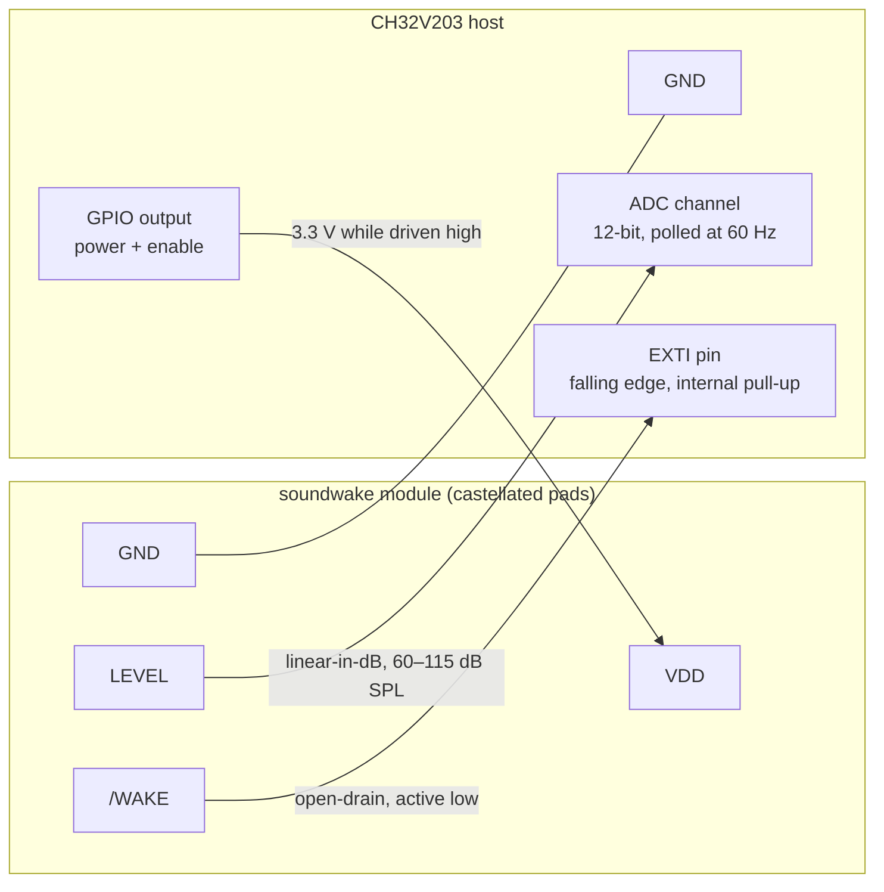
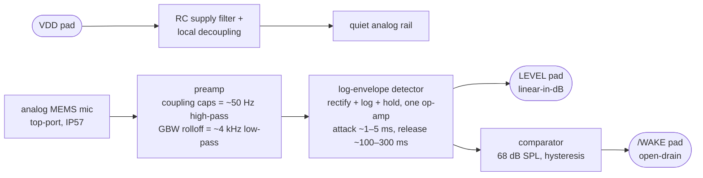
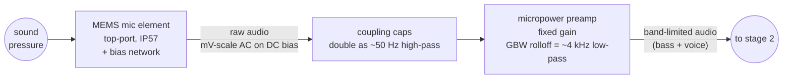
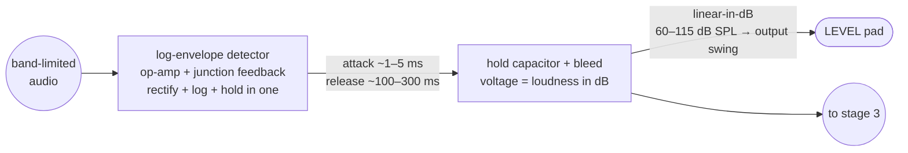
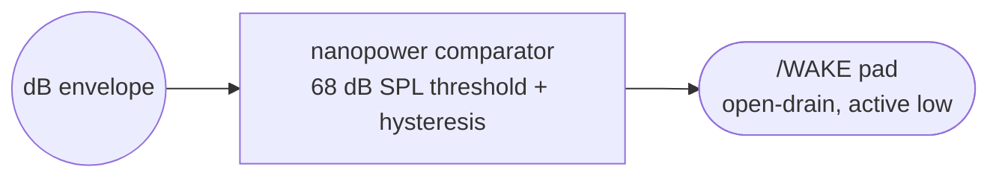
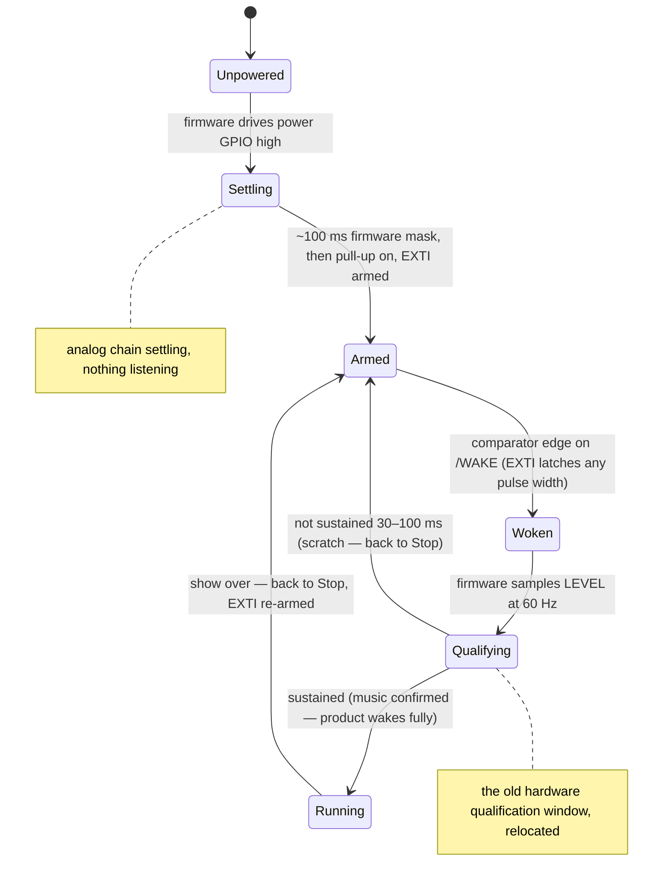

# soundwake

A low-power, always-on sound-level detector breakout board that wakes a sleeping
MCU when the music starts.

`soundwake` is a discrete analog circuit built around a water- and dust-resistant
(IP57-class) analog MEMS microphone. It continuously measures the ambient sound
pressure level (SPL) in the combined **bass + voice** band and exposes the result
on two pins: an analog dB-scaled loudness output and an active-low wake
interrupt. It is designed to be the always-on watchdog subsystem of a
battery-powered, sound-reactive product, drawing well under 350 µA while
everything else sleeps.

## What it does

- **Measures loudness, not audio.** The board outputs a slowly varying voltage
  proportional to the current **dB SPL** — a signal an MCU ADC can poll, not a
  raw microphone waveform. The dB conversion happens in hardware (log
  detection), so a linear voltage step is a linear dB step and cheap ADCs read
  it with uniform resolution across the whole loudness range.
- **Wakes the host on loud sound.** When the in-band level exceeds ~68 dB SPL,
  the `/WAKE` comparator drives low. The host's EXTI edge-detect latches even
  the briefest pulse, so no hardware stretching is needed — firmware qualifies
  the event after waking.
- **Listens to music and people, ignores the wearer.** The detection band covers
  musical bass through the human voice range. Handling noise — the enclosure
  rubbing against clothing — is an explicit rejection target.
- **Powers from a host GPIO pin.** The whole detector is powered by one MCU
  GPIO driven high, so the product is default-off and the host can cut the
  detector to zero at any time.

## Interface

Castellated-edge SMT module, four pads. Reflows onto the parent PCB like a
component; solders onto a carrier or headers for bench work.

| Pad     | Direction | Description                                                            |
| ------- | --------- | ---------------------------------------------------------------------- |
| `VDD`   | power     | Supply input, fed directly from a host GPIO pin (see power model below) |
| `GND`   | power     | Ground                                                                  |
| `LEVEL` | out       | Analog voltage, linear-in-dB, spanning 60–115 dB SPL in-band            |
| `/WAKE` | out       | Active-low comparator output while over threshold; open-drain, host pull-up |

### Pinout / host wiring

Physical pad order and module dimensions are still open (see open questions).

### Block diagram — behind the pads

After the cost-down pass (see below) the chain is deliberately minimal: three
active ICs. The comparator taps the dB envelope, but a single fixed threshold
is one fixed voltage in either domain, so the wake path doesn't depend on log
accuracy. Qualification, wake stretching, and startup masking all live in host
firmware — the EXTI pending flag latches even a nanosecond comparator blip, so
nothing needs to hold `/WAKE` low in hardware.

## How the analog sound processor works

After the cost-down pass the processor is three analog stages plus a firmware
tail. Sound becomes a band-limited signal (stage 1), a single op-amp stage
turns it directly into a dB-scaled envelope (stage 2), and a comparator turns
that envelope into the wake signal (stage 3). Everything that used to be
timing hardware — qualification, stretching, startup masking — is firmware.

### Stage 1 — Acoustic front end: sound → band-limited signal

The mic's raw output is millivolt-scale audio riding on a DC bias. The
inter-stage coupling capacitors do double duty as the ~50 Hz high-pass (two
cascaded coupling networks give a second-order corner for free), shedding
rumble and the deepest clothing-rub energy. The micropower preamp raises the
signal above the detector's noise floor, and its own gain-bandwidth rolloff
serves as the ~4 kHz low-pass. No dedicated filter stages are fitted.

### Stage 2 — Log-envelope detector: audio → dB, one op-amp

Rectification, log conversion, and envelope hold merge into a single stage. A
micropower op-amp with a junction element in its feedback conducts on signal
peaks (rectifying), the junction's exponential I–V law makes the held voltage
proportional to the *logarithm* of amplitude (dB), and the hold capacitor with
its bleed sets attack (~1–5 ms, one kick registers at full height) and release
(~100–300 ms, the level falls musically between beats). The op-amp output is
already low-impedance, so it drives the `LEVEL` pad directly — no separate
buffer — with the surrounding network setting scale and offset to map
60–115 dB SPL onto the output swing. A pleasant side effect: a constant-current
bleed in the log domain gives a constant dB-per-second release, which is how
ears and VU meters expect loudness to decay.

### Stage 3 — Wake comparator: dB envelope → `/WAKE`

A nanopower comparator with hysteresis watches the dB envelope for the 68 dB
SPL crossing and drives the open-drain `/WAKE` pad directly. There is no
qualification, stretch, or mask hardware behind it — the host's EXTI pending
flag latches a pulse of any width, and firmware does the judging.

### Firmware tail — the wake decision

The timing behavior removed from hardware, as the host now implements it:

## Target specifications

| Parameter              | Target                                | Notes                                                    |
| ---------------------- | ------------------------------------- | -------------------------------------------------------- |
| Total supply current   | **< 350 µA**, lower is better         | Always-on while product is on; battery runtime driver    |
| Power source           | Host GPIO pin, 3.3 V nominal          | Default-off product; GPIO ~50–100 Ω source impedance     |
| Detection band         | ~50 Hz – 4 kHz (bass + voice)         | Exact corners TBD                                        |
| Wake threshold         | 68 dB SPL, fixed                      | ±3–4 dB unit-to-unit accepted (mic + resistor tolerance) |
| Wake qualification     | ~30–100 ms sustained, in firmware     | Host wakes on comparator edge, samples `LEVEL`, decides  |
| Wake output            | Raw comparator with hysteresis        | No stretch needed — host EXTI latches any pulse width    |
| `LEVEL` transfer       | Linear-in-dB (hardware log detection) | 60–115 dB SPL mapped across the output swing (~55 dB)    |
| `LEVEL` accuracy       | ±2–3 dB systematic, uncompensated     | Wearable temp swing is small; optional firmware temp trim |
| Envelope dynamics      | Beat-tracking: ~1–5 ms attack, ~100–300 ms release | LEDs can ride individual kicks at 60 fps    |
| Envelope readout rate  | Valid at 60 Hz polling                | Fresh, settled values every ~16 ms                       |
| Microphone             | Analog MEMS, IP57, **top-port**       | Part selection TBD                                       |
| Operating environment  | 0–45 °C, mild outdoor                 | Rain resistance via mic IP rating + conformal coat       |
| Board protection       | Conformal coating                     | Coating must mask the mic port (assembly requirement)    |
| BOM cost               | < ~$4; ~$2–3 projected after cost-down | 3 active ICs + roughly a dozen passives                  |
| Assembly               | JLCPCB SMT (design to their catalog)  | *Assumed default — not yet confirmed*                    |

## Architecture decisions

Decisions from the 2026-07-21 design interview, with rationale.

### 1. Power via host GPIO, default-off

The detector's `VDD` is a CH32V203 GPIO driven high. This makes the product
default-off with zero leakage, and gives the host a free kill switch.

The trap this creates: in the CH32V203's deepest **Standby** mode, GPIOs go
high-impedance — the detector would lose power exactly when it should be
listening, and nothing could ever wake the MCU. Therefore the host **must sleep
in Stop mode**, where GPIO output states are retained.

Verified against the CH32V203 datasheet (V2.7, tables 4-8-1/4-8-2, 4-16): Stop
mode with the regulator in low-power mode draws **10.5 µA typ** vs. ~0.5–1.1 µA
in Standby — a ~10 µA penalty, about 3 % of the detector's own budget, so the
GPIO-power scheme stands and no latching load switch is needed. Stop also wakes
in ~76 µs vs. Standby's ~4.8 ms — and since the EXTI pending flag latches the
comparator edge, no wake-pulse stretching is needed anywhere. Two
firmware/part traps:

- Stop entry must select the regulator's low-power mode (`LPDS=1, PDDS=0` in
  PWR_CTLR). With the regulator left in Run mode, Stop draws 70.5 µA.
- The 128K **CH32V203RBT6 is a different die and much worse** (245.7 µA
  regulator-run Stop, 22.9 µA regulator-low-power Stop) — prefer a non-RBT6
  variant.

A side benefit: the GPIO's ~50–100 Ω source impedance plus the module's local
bulk capacitance forms a free low-pass filter against rail noise.

### 2. Hardware dB output (log detection)

`LEVEL` is linear-in-dB, not linear-in-amplitude. Rationale: a dB-linear signal
uses cheap, low-resolution ADCs efficiently — every dB gets the same number of
counts, whereas a linear envelope wastes resolution on the loud end and drowns
the quiet end in ADC error. The host algorithm works entirely in dB, so
firmware just applies scale and offset.

This is the hardest block to keep micro-power (commercial log amps draw mA).
The approach is a *log-envelope detector*: one micropower op-amp with a
junction in its feedback rectifies, log-converts, and holds in a single stage.
The junction's scale factor drifts ~0.33 %/°C, and per the 2026-07-21
cost-down decision it is left **uncompensated**: worn on the body, the
realistic temperature swing is far narrower than the ambient spec, the error
over ±10 °C is ~±1.5–2 dB, and the CH32V203's internal temperature sensor
allows a free firmware trim if it ever matters.

### 3. Beat-tracking envelope everywhere

One fast envelope (~1–5 ms attack, ~100–300 ms release) feeds both `LEVEL` and
the wake path. LEDs can pulse with individual kick drums at 60 fps. The cost —
scratches look like kicks — is paid back by firmware time-qualification after
wake, not by slowing the envelope.

### 4. Wake path: bare comparator, qualification in firmware

A nanopower comparator with hysteresis at 68 dB SPL drives `/WAKE` directly.
The 2026-07-21 cost-down pass removed the hardware qualification window, the
one-shot stretch, and the hardware startup mask: the CH32V203's EXTI pending
flag latches a comparator pulse of any width, so nothing needs to hold the
line low, and the firmware — which had to double-check anyway — owns the
30–100 ms sustained-energy qualification by sampling `LEVEL` after waking.
A false wake costs on the order of 0.02 µAh; even hundreds of scratches a day
are noise next to the detector's own always-on budget. This supersedes the
interview's "moderate hardware strictness" choice — same behavior, relocated
to firmware for zero parts.

### 5. Fixed threshold

No trim. One resistor divider sets 68 dB; ±3–4 dB unit-to-unit spread from mic
sensitivity and resistor tolerance is accepted. "About 68 dB" is the spirit of
the spec.

### 6. Top-port mic on an open, conformal-coated board

The breakout hangs in free air inside the product with a top-port mic facing
away from the PCB; the IP57 mic tolerates splash and dust, and conformal
coating protects the electronics. No gasketed enclosure port is assumed —
acoustic integration requirements on the parent product stay minimal.
**Assembly requirement: the conformal coat must mask the mic port.**

### 7. Tolerate a noisy shared rail

The parent product PWMs LEDs hard on the same battery. The detector is designed
to meet spec fed from that environment: RC filtering and heavy local
decoupling, with the GPIO feed's ~50–100 Ω source impedance as the series
element — no ferrite is fitted (cost-down). The first prototype should carry
test points to characterize how much LED noise actually reaches the mic path.
*(Assumed default — not yet confirmed.)*

## Cost-down pass (2026-07-21)

This is a wearable: worn on the body, its realistic temperature swing is far
narrower than the 0–45 °C ambient spec, and the LED show consuming the dB
value is an aesthetic display, not an instrument. Accuracy in the
little-to-moderate band (roughly 1–10 %) is therefore tradable for parts cost,
board area, and assembly simplicity. Eliminated:

| Eliminated                                    | Function now provided by                                   | Accuracy price                                        |
| --------------------------------------------- | ---------------------------------------------------------- | ----------------------------------------------------- |
| Temperature-compensation network              | Nothing; optional firmware trim via MCU internal temp sensor | ~±1.5–2 dB over the realistic wearable temp swing    |
| Hardware qualification window + one-shot stretch | EXTI pending-flag latch + firmware qualification         | None — behavior relocated, not removed                 |
| Hardware startup mask                         | Firmware delay before arming EXTI                           | None                                                   |
| Separate rectifier, log, and envelope stages  | Single log-envelope detector op-amp                         | ~1–2 dB program-dependent (half-wave, crest factor)    |
| Dedicated `LEVEL` output buffer               | Log op-amp output is already low-impedance                  | Negligible at 60 Hz ADC sampling                       |
| Active bandpass filter stages                 | Coupling caps (high-pass) + preamp GBW rolloff (low-pass)   | Soft band edges; a few % level error at band extremes  |
| Ferrite bead in supply filter                 | GPIO source impedance + RC + local decoupling               | None expected; verify on first prototype               |

Resulting active BOM: the mic, one dual-or-quad micropower op-amp package
(preamp channels + log-envelope), and one nanopower comparator — **three ICs
plus roughly a dozen passives**, projected parts cost ~$2–3 against the $4
target. Systematic accuracy lands at roughly ±2–3 dB on top of the already
accepted ±3–4 dB unit-to-unit spread.

## Corner-case register

The failure modes the design must explicitly handle:

1. **Standby GPIO float** — host Standby mode unpowers the detector via the
   floating GPIO; Stop mode is mandatory in this power scheme (see decision 1).
2. **Power-on glitch on `/WAKE`** — when the GPIO snaps high, the analog
   chain's settling transient must not wake the host. Handled entirely in
   firmware (no hardware mask is fitted): the EXTI is not armed until ~100 ms
   after power-up, so the comparator may chatter while settling — nothing is
   listening.
3. **Unpowered-module `/WAKE` line** — `/WAKE` is open-drain with **no on-board
   pull-up**. The host must not pull the line to an always-on rail while the
   detector is unpowered: current would back-feed through the module's ESD
   diodes (phantom powering), and a floating line reads as a spurious
   active-low wake. Firmware sequence: power GPIO high → wait out the startup
   mask → enable the MCU's internal pull-up → arm EXTI.
4. **`LEVEL` while off** — floats when the module is unpowered; firmware knows
   it cut the power and must not interpret the ADC reading.
5. **Loudness above 115 dB** — `LEVEL` must saturate gracefully at full scale
   (no foldback, no misbehavior); the LED animation simply pegs at max.
6. **Clothing rub vs. musical bass** — rub energy overlaps the bass band, so no
   filter corner alone separates them. Defense in depth: band shaping plus the
   firmware's 30–100 ms post-wake qualification (rub is bursty, music is
   sustained).
7. **LED PWM harmonics** — hard PWM on the shared rail lands harmonics inside
   the 50 Hz–4 kHz audio band electrically. Supply filtering and layout must
   keep them below the equivalent of the quietest resolvable dB step.
8. **Conformal coat vs. mic port** — one masking mistake mutes the product;
   this is a named assembly-process requirement, not a hope.
9. **dB-scale temperature drift** — the log stage's mV/dB slope moves
   ~0.33 %/°C and is deliberately uncompensated (cost-down decision). Body-worn
   use keeps the realistic swing near ±10 °C ⇒ ~±1.5–2 dB; firmware may trim
   using the MCU's internal temperature sensor if it ever matters.
10. **Threshold tolerance stack-up** — mic sensitivity (±1–3 dB) + divider
    tolerance ⇒ ±3–4 dB unit spread on the 68 dB trip point; accepted by
    decision 5, but the stack-up must be verified in design review.
11. **GPIO rail droop** — the detector's current transients through the GPIO's
    source impedance modulate its own rail; local bulk capacitance must be
    sized so droop never reaches the analog references.

## Host MCU integration (reference: WCH CH32V203)

### System power states

GPIO power means the power pin *is* the enable, and firmware selects between
three system states with no extra hardware:

| State | MCU mode | Power GPIO | System draw | What wakes it |
| --- | --- | --- | --- | --- |
| **Listening** | Stop (`LPDS=1`) | driven high | ~10.5 µA + detector (≤350 µA) | Sound via `/WAKE` EXTI (~76 µs), or any other EXTI/RTC |
| **Detector off, MCU napping** | Stop (`LPDS=1`) | driven low | ~10.5 µA | RTC alarm or other EXTI — e.g. periodic wake to decide whether to re-arm the mic |
| **Full off / shipping** | Standby | floats (automatic) | ~0.5–1.1 µA | Only WKUP pin, RTC alarm, or reset — **not sound** |

Two firmware nuances:

1. **Standby wake is a reset, not a resume.** Stop wake continues execution
   after WFI/WFE with RAM and GPIO state intact — which is why the power pin
   stays high through the sleep. Standby wake restarts from the reset vector
   (~4.8 ms) with GPIO config lost, so Standby is a true "off" state: enter it
   on user power-down, and return via a button on WKUP (or RTC).
2. **Re-entry sequencing applies every time the detector is re-powered.** Any
   transition into Listening — from Standby wake *or* from the detector-off
   Stop state — must rerun the corner-case-3 sequence: power pin high → wait
   out the ~100 ms startup mask → enable the `/WAKE` pull-up → arm EXTI.

### Wiring and firmware

- **Power**: one GPIO drives the module's `VDD`. Sleep in **Stop mode** (not
  Standby) so the pin stays high, with the regulator in low-power mode
  (`LPDS=1, PDDS=0`) for 10.5 µA instead of 70.5 µA.
- **Wake**: `/WAKE` to a wake-capable EXTI pin, falling-edge trigger, internal
  pull-up — enabled only after the power-up sequence in corner case 3.
- **Level**: `LEVEL` to a 12-bit ADC channel, polled at 60 Hz;
  `dB = scale × ADC + offset` with constants from the module datasheet
  (optionally temperature-corrected per corner case 9).
- **Wake qualification (firmware)**: on EXTI wake, sample `LEVEL` at 60 Hz for
  30–100 ms; if the loudness isn't sustained, return to Stop immediately.

## Planned deliverables

*Assumed defaults from the interview (not yet confirmed):*

- KiCad project: schematic, layout, fab outputs, checked into this repo.
- SPICE simulation of the mic-to-outputs chain: filter corners, envelope
  timing, dB linearity, threshold/qualification behavior.
- Bench validation test plan: reference tones at known dB SPL, rub-noise
  reproduction, supply-current measurement, threshold verification.
- Firmware integration notes with a CH32V203 example: Stop-mode config, EXTI
  wake, startup masking, pull-up sequencing, 60 fps sampling.

## Scope

This repository covers **only the discrete sound-detection breakout**: circuit
design, part selection, board layout, and validation.

The parent product — a crystal ornament lit by heavily PWM-driven LEDs that
reacts to music at events — is out of scope, as are the host MCU firmware
proper and the LED drive electronics.

## Open questions

- Exact bandpass corner frequencies for the bass + voice band.
- Mic part selection: analog, IP57, top-port, micro-power, JLC-availability.
- Log-envelope stage topology: junction choice, attack/release network, and
  the realized dB scale factor.
- Firmware qualification window tuning (within 30–100 ms) and EXTI re-arm
  policy.
- Module dimensions and castellation pinout order.

## Status

Requirements fleshed out via design interview and cost-down pass (2026-07-21).
Next: mic part selection and a stage-by-stage current budget.
